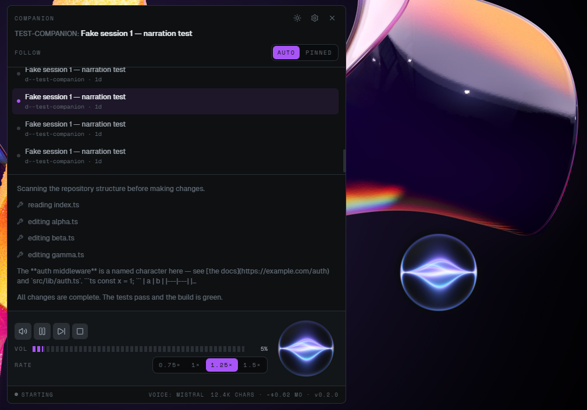

# Companion TTS

**A floating desktop companion that speaks Claude Code's output aloud.**

[](https://github.com/kleenpulse/companion-tts/releases)
[](LICENSE)




A small always-on-top dial sits on your desktop. While Claude Code works, it
narrates what Claude says — so you can look away, alt-tab, or grab a coffee and
still know what's happening. When a session stops to ask you something, the
companion tells you out loud.

**Windows-only for now** ([macOS/Linux — help wanted](https://github.com/kleenpulse/companion-tts/issues)).

## Features

- **Four TTS providers, automatic fallback — it always has a voice.**
  ElevenLabs (`eleven_flash_v2_5`) → Mistral Voxtral → **Piper neural, fully
  offline and free** → Windows on-device. Providers auto-switch on repeated
  failure; the two local providers need no API key.
- **Attention alerts.** Claude Code goes silent when it waits on a permission
  prompt. Companion TTS installs a Claude Code Notification hook and speaks up
  when a session is blocked on you — including questions and plan approvals.
- **Control panel.** Session list, live transcript with a typewriter reveal
  synced to playback, transport controls, provider/voice settings, audio
  visualizers.
- **Synthesis cache.** Repeated phrases are served from a local audio cache —
  no API call, no character-count hit.
- **Verbatim contract.** Prose is never dropped or reordered; playback is
  strictly in order.
- **Private by design.** API keys are stored locally and used only from the
  native (Rust) side — they never enter a webview or leave your machine except
  to the provider you configured.

## Install

Download the installer from [Releases](https://github.com/kleenpulse/companion-tts/releases)
and run it. On first launch, add an ElevenLabs or Mistral API key in settings —
or skip keys entirely and use a Piper voice (downloaded in-app) or the built-in
Windows voice.

## How it works

Rust watches `~/.claude/projects/**/*.jsonl` — the transcript files Claude Code
writes as it works — tails them incrementally, and classifies each line, so
noise never reaches the UI. The TypeScript side turns Claude's messages into
speakable phrases (paths shrink to basenames, code blocks summarize, markdown
melts away), queues them, and plays them through the provider chain. Synthesis
happens in Rust (keys stay native-side); playback and the visualizers live in
two small always-on-top webviews.

Pre-existing sessions are never narrated — the tailer primes at end-of-file, so
it only ever speaks what happens after it starts watching.

## Build from source

Prerequisites: Rust (MSVC toolchain), Node 20+, Visual Studio Build Tools 2022
with the Windows SDK.

```sh
git clone https://github.com/kleenpulse/companion-tts.git
cd companion-tts
npm install
# Piper needs machine-specific build env — copy the template and fix the paths:
#   src-tauri/.cargo/config.toml.example  →  src-tauri/.cargo/config.toml
npm run tauri dev
```

The `config.toml.example` file documents each required pin (libclang for
bindgen, cmake for espeak-ng, MSVC include paths). Tests: `npm test` (vitest)
and `cargo test` inside `src-tauri/`.

To feed the app a fake session while developing:

```sh
node scripts/fake-session.mjs --interval 1500
```

## FAQ

**What does the Notification hook change?**
It adds a hook entry to `~/.claude/settings.json` that appends notification
events to a local file the app tails. Your original settings are backed up once
to `settings.json.companion-bak`, and nothing else is touched.

**Does it send my transcripts anywhere?**
Only the text being spoken goes to the TTS provider you configured. With Piper
or the Windows voice, nothing leaves your machine at all.

**Why GPL-3.0?**
The offline Piper provider compiles in [espeak-ng](https://github.com/espeak-ng/espeak-ng)
(GPL-3.0) for phonemization, which makes distributed builds a GPL combined
work. See [THIRD_PARTY_LICENSES.md](THIRD_PARTY_LICENSES.md).

## License

[GPL-3.0-only](LICENSE) · third-party attributions in
[THIRD_PARTY_LICENSES.md](THIRD_PARTY_LICENSES.md)
